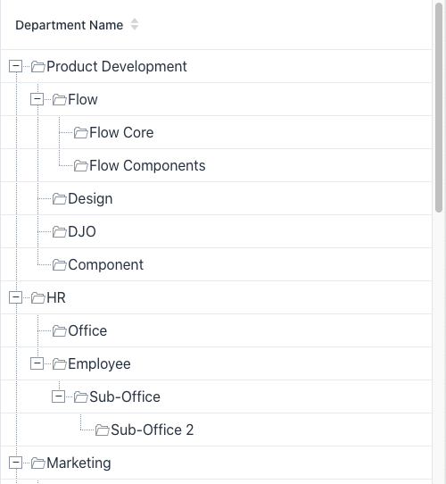
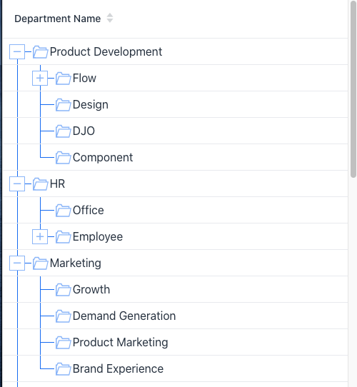

# 


## Licence

This component is part of Vaadin Prime. Still, open source you need to have a valid CVAL license in order to use it. Read more at: [vaadin.com/pricing](https://vaadin.com/pricing)

## Development instructions

Starting the demo server:

Go to explorer-tree-grid-flow-demo and run:
```
mvn jetty:run
```

This deploys demo at http://localhost:8080

## How to use it

Just replace the TreeGrid to ExplorerTreeGrid in your code.

The default API is the same. It also add a new method to display a text and an icon.

## Examples

Just replace the TreeGrid to ExplorerTreeGrid in your code

### Default usage

```
private TreeGrid<Department> buildGrid() {
    DepartmentData departmentData = new DepartmentData();
    ExplorerTreeGrid<Department> grid = new ExplorerTreeGrid<>();
    grid.setItems(departmentData.getRootDepartments(),
            departmentData::getChildDepartments);
    grid.addHierarchyColumn(Department::getName).setHeader("Department Name");
    grid.setSizeFull();
    grid.expand(departmentData.getRootDepartments());
    return grid;
}
```
### Template Renderer and icon

```
ExplorerTreeGrid<DummyFile> grid = new ExplorerTreeGrid<>();
grid.addHierarchyColumn(DummyFile::getFilename, DummyFile::getIcon).setHeader("File Name");
add(grid);
```
### Component Renderer

```
ExplorerTreeGrid<DummyFile> grid = new ExplorerTreeGrid<>();
grid.addComponentHierarchyColumn(value -> {
    Icon icon = VaadinIcon.FOLDER_OPEN_O.create();
    icon.setColor("var(--lumo-contrast-50pct)");
    return new Span(icon, VaadinIcon.CLIPBOARD.create(), new Span(value.getFilename()));
}).setHeader("Department Name");
```

### Customize the Explorer Tree Grid

By default, there are few css variables that help you to change the style of the Explorer Tree Grid:

| CSS Variable | Definition | Default value |
|--------------|------------|---------------|
| --explorer-tree-grid-toggle-level-offset   | Width of the spacer for each level    | 1.5rem |
|  --explorer-tree-grid-expand-icon-width |   Size of the expand/collapse icon     |  0.8rem |
|  --explorer-tree-grid-icon-type-width |   Size of the icon generated in the template renderer    | 1.1rem  |  
|  --explorer-tree-grid-icon-type-margin |  Margins before and after the icon    | 0.1rem  |    
|  --explorer-tree-grid-line-color |  Color of the connectors   |  var(--lumo-contrast-50pct) |    
|  --explorer-tree-grid-icon-color |   Color of the expand/collapse icon and icon generated in the template renderer   |  var(--lumo-contrast-50pct) |    
|  --explorer-tree-grid-icon-hover-color |   Color of the expand/collapse icon when hovered   | var(--lumo-contrast-80pct)  |    
|  --explorer-tree-grid-border-style |   Style of the connectors   | dotted  |   
|  --explorer-tree-grid-left-offset  |  Negative offset for the first column    | var(--lumo-space-s) | 
|  --explorer-tree-grid-default-margin |   Default margin for the grid cell   | var(--lumo-space-m)  | 
|  --explorer-tree-grid-icon-background  |   Background of the expand/collapse icon   | var(--lumo-base-color)  |  

#### Default Theme



#### Custom Theme
```
:host {
    --explorer-tree-grid-toggle-level-offset: 2rem;
    --explorer-tree-grid-icon-type-width: 1.5rem;
    --explorer-tree-grid-expand-icon-width: 1.2rem;
    --explorer-tree-grid-icon-type-margin: 0.1rem;
    --explorer-tree-grid-line-color: var(--lumo-primary-color);
    --explorer-tree-grid-icon-color: var(--lumo-primary-color-50pct);
    --explorer-tree-grid-icon-hover-color: var(--lumo-primary-color);
    --explorer-tree-grid-border-style: solid;
}
```




## Notes

The add-on is working in Dark Mode and RTL. The theme is based on Lumo.

If you want to use Material Theme, then you will have to set the variables and also the expand/collapse icon.
